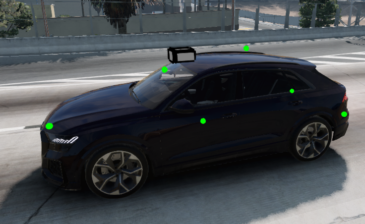
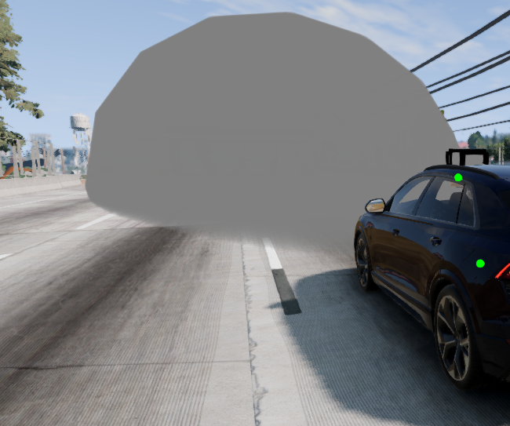
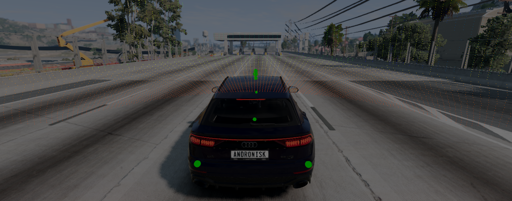

  

# VisionPilot: Autonomous Driving Simulation, Computer Vision & Real-Time Perception (BeamNG.tech)

  

## Table of Contents
- [VisionPilot: Autonomous Driving Simulation, Computer Vision \& Real-Time Perception (BeamNG.tech)](#visionpilot-autonomous-driving-simulation-computer-vision--real-time-perception-beamngtech)
  - [Table of Contents](#table-of-contents)
  - [Overview](#overview)
  - [Demos](#demos)
    - [Emergency Braking (AEB) Demo](#emergency-braking-aeb-demo)
    - [Sign Detection \& Detection and classification](#sign-detection--detection-and-classification)
  - [Traffic Light Detection \& Classification Demo](#traffic-light-detection--classification-demo)
    - [Latest Lane Detection Demo (v2)](#latest-lane-detection-demo-v2)
      - [Previous Lane Detection Demo (v1)](#previous-lane-detection-demo-v1)
  - [Foxglove Visualization Demo](#foxglove-visualization-demo)
  - [Built With](#built-with)
  - [Sensor Suite](#sensor-suite)
  - [Configuration Files](#configuration-files)
  - [Roadmap](#roadmap)
    - [Perception](#perception)
    - [Sensor Fusion \& Calibration](#sensor-fusion--calibration)
    - [Control \& Planning](#control--planning)
    - [Simulation \& Scenarios](#simulation--scenarios)
    - [Visualization \& Logging](#visualization--logging)
    - [README To-Dos](#readme-to-dos)
    - [Other](#other)
  - [Legend](#legend)
  - [Credits](#credits)
    - [BeamNG.tech Citation](#beamngtech-citation)

## Overview

A modular Python project for autonomous driving research and prototyping, fully integrated with the BeamNG.tech simulator and Foxglove visualization. This system combines traditional computer vision and state-of-the-art deep learning (CNN, U-Net, YOLO, SCNN) with real-time sensor fusion and autonomous vehicle control to tackle:

- Lane detection (Traditional CV, SCNN, OpenCV; capable of highway scenarios)
- Traffic sign classification & detection (CNN, YOLOv11)
- Traffic light detection & classification (YOLOv11, CNN)
- Vehicle & pedestrian detection and recognition (YOLOv11)
- Multi-sensor fusion (Camera, LiDAR, Radar, GPS, IMU)
- Multi-model inference, real-time simulation, autonomous driving with PID control (BeamNG.tech)
- Cruise control
- Real-time visualization and monitoring (Foxglove WebSocket)
- Modular configuration system (YAML-based)
- Drive logging and telemetry

## Demos

### Emergency Braking (AEB) Demo

Watch the Emergency Braking System (AEB) in action with real-time radar filtering and collision avoidance:

**At a Glance:** Radar-based collision avoidance, real-time braking, AEB logic.

**Extended Demo:** [Watch the full video here](https://www.youtube.com/watch?v=Z8Y2-MpmrRg)

---

### Sign Detection & Detection and classification

This demo shows real-time traffic sign detection and classification:

**Extended Demo:** [Watch the full video here](https://youtu.be/ujGkQJ2BqV0)

---

## Traffic Light Detection & Classification Demo

This demo shows real-time traffic light detection and classification:

> No extended Demo avaliable yet.

---

### Latest Lane Detection Demo (v2)

Watch the improved autonomous lane keeping demo (v2) in BeamNG.tech, featuring smoother fused CV+SCNN lane detection, stable PID steering, and robust cruise control:

**Extended Demo:** [Watch the full video here](https://www.youtube.com/watch?v=7eA_XfIkLWQ)

> Note: Very low-light (tunnel) scenarios are not yet supported.

---

#### Previous Lane Detection Demo (v1)

The original demo is still available for reference:

[Lane Keeping & Multi-Model Detection Demo (v1)](https://youtu.be/f9mHigMKME8)

---

## Foxglove Visualization Demo

See real-time LiDAR point cloud streaming and autonomous vehicle telemetry in Foxglove Studio:

**Extended Demo:** [Watch the full video here](https://www.youtube.com/watch?v=4HJDvL2Q6AY)

> More demo videos and visualizations will be added as features are completed.

---

## Built With

- **Simulation:** BeamNG.tech (https://www.beamng.tech/)
- **Visualization:** Foxglove Studio (WebSocket real-time visualization)
- **Deep Learning:** TensorFlow / Keras, PyTorch
- **Computer Vision:** OpenCV, YOLO (Ultralytics)
- **Language:** Python 3.8+
- **Control Systems:** PID controllers, sensor fusion

## Sensor Suite

The vehicle is equipped with a comprehensive multi-sensor suite for autonomous perception and control:

| Sensor | Specification | Purpose |
|--------|---------------|---------|
| **Front Camera** | 1920x1080 @ 50Hz, 70° FOV, Depth enabled | Lane detection, traffic signs, traffic lights, object detection |
| **LiDAR (Top)** | 80 vertical lines, 360° horizontal, 120m range, 20Hz | Obstacle detection, 3D scene understanding |
| **Front Radar** | 200m range, 128×64 bins, 50Hz | Collision avoidance, adaptive cruise control |
| **Rear Left & Right Radar** | 30m range, 64×32 bins, 50Hz | Blindspot monitoring, rear object detection ||
| **Dual GPS** | Front & rear positioning @ 50Hz | Localization reference |
| **IMU** | 100Hz update rate | Vehicle dynamics, motion estimation |

<table>
  <tr>
    <td align="center"></td>
    <td align="center"></td>
    <td align="center"></td>
  </tr>
  <tr>
    <td align="center"><em>Sensor Array</em></td>
    <td align="center"><em>Front Radar</em></td>
    <td align="center"><em>Lidar Visualization</em></td>
  </tr>
</table>

## Configuration Files
Configuration files are located in the `beamng_sim/config/` directory:
> Descriptions of the configuration files can be found in the `config/README.md` file. (Currently Outdated, will be updated later)

## Roadmap

### Perception
- [x] Sign classification & Detection (CNN / YOLOv11m)
- [x] Traffic light classification & Detection (CNN / YOLOv11m)
- [x] Lane detection Fusion (SCNN / CV)
- [x] Advanced lane detection using OpenCV (robust highway, lighting, outlier handling)
- [x] Integrate Majority Voting system for CV
- [x] ⭐ Semantic Segmentatation (Already built not implemented here yet)
- [ ] Real-Time Object Tracking
- [ ] Handle dashed lines better in lane detection
- [ ] Stop Sign Yield Sign Detection and Response
- [ ] Dynamic Target Speed based on Speed Limit Signs
- [ ] 🔥 Lidar Object Detection 3D
- [ ] Detect multiple lanes
- [ ] Lane Change Logic
- [ ] 💤 Road Surface & Condition Detection and Classification
- [ ] 💤 Multi Camera Setup (Will implement after all other camera-based features are finished)
- [ ] 💤 Overtaking, Merging (Will be part of Path Planning)

### Sensor Fusion & Calibration
- [x] Integrate Radar
- [x] Integrate Lidar
- [ ] Integrate GPS
- [ ] Integrate IMU
- [ ] Ultrasonic Sensor Integration (Can easily be implemented with prebuilt Beamng ADAS module)
- [ ] Map Matching algorithm
- [ ] 💤 💤 SLAM (simultaneous localization and mapping)
- [ ] Sensor Health Monitoring & Redundancy
  - [ ] Redundant Front Radar for AEB
  - [ ] Sensor status diagnostics and failover

### Control & Planning
- [x] Integrate vehicle control (Throttle, Steering, Braking Implemented) (PID needs further tuning)
- [x] Integrate PIDF controller
- [x] ⭐ Adaptive Cruise Control (Currently only basic Cruise Control implemented)
- [x] ⭐ Emergency Braking / Collision Avoidance (Using Front radar)
- [ ] Blindspot Monitoring (Using left/right rear short range radars)
- [ ] Path planning
- [ ] 💤 End-to-end driving policy learning (RL, imitation learning)
- [ ] 💤💤 Advanced traffic participant prediction (trajectory, intent)

### Simulation & Scenarios
- [x] Integrate and test in BeamNG.tech simulation (replacing CARLA)
- [x] Modularize and clean up BeamNG.tech pipeline
- [x] Tweak lane detection parameters and thresholds
- [ ] Traffic scenarios: driving in heavy, moderate, and light traffic
- [ ] Test Lighting conditions
- [ ] 💤💤 Test using actual RC car
- [ ] 💤 Containerize Models

### Visualization & Logging
- [x] ⭐ Full Foxglove visualization integration (Overhaul needed)
- [x] Modular YAML configuration system
- [x] Real-time drive logging and telemetry
- [ ] 🔥 Real time Annotations Overlay in Foxglove
- [ ] Live Map Visualization

### README To-Dos
- [x] Add demo images and videos to README
- [ ] Add performance benchmarks section
- [x] Add Table of Contents for easier navigation

### Other
- [x] Vibe-Code a website for the project
  
> Driver Monitoring System would've been pretty cool but human drivers are not implemented in BeamNG.tech

## Legend
> 🔥 = High Priority

> ⭐ = Complete but still being improved/tuned/changed (not final version)

> 💤 = Minimal Priority, can be addressed later

> 💤💤 = Very Low Priority, may not be implement

## Credits
- Datasets: CU Lane, LISA, GTRSB, Mapillary, BDD100K
- Models: Ultralytics YOLOv8, custom CNNs
- Simulation: BeamNG.tech ([BeamNG GmbH](https://www.beamng.tech/))
- Special thanks to [Kaggle](https://www.kaggle.com/) for providing free GPU resources for model training without them it would've been imposible to train such good models.
- I would also like to thank my teacher and supervisor Mr. Pratt for their guidance and support throughout this project.

### BeamNG.tech Citation

> **Title:** BeamNG.tech  
> **Author:** BeamNG GmbH  
> **Address:** Bremen, Germany  
> **Year:** 2025  
> **Version:** 0.35.0.0  
> **URL:** https://www.beamng.tech/
